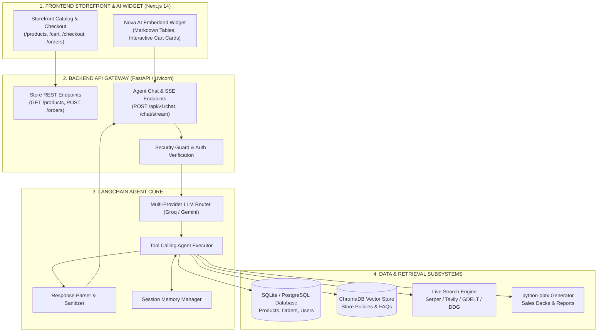

# SupportIQ — Intelligent Agentic Customer Support & E-Commerce Platform

[](https://fastapi.tiangolo.com)
[](https://nextjs.org)
[](https://python.langchain.com)
[](https://www.trychroma.com)
[](https://tailwindcss.com)

**SupportIQ** is an enterprise-grade autonomous AI customer support and retail intelligence platform built for **NovaCart**, a modern tech and hardware storefront. It combines real-time context-aware conversational AI, multi-document RAG (Retrieval-Augmented Generation), live relational database actions, multi-engine internet search, and automated executive PowerPoint reporting.

---

## 🌟 Key Features

### 1. 🛍️ Full-Featured NovaCart Storefront
- **Next.js 14 App Router** with Tailwind CSS and responsive design.
- **Dynamic Catalog**: Laptops, flagship smartphones (iPhone 16 Pro Max, 16 Pro, 16, 15, Galaxy S25 Ultra), audio gear, and displays.
- **Cart & Checkout**: Persistent cart state (`localStorage`), real-time stock validations, and tiered shipping calculations (Free Express courier delivery for orders > PKR 25,000).
- **Order Tracking**: Real-time status lookup, package courier tracking (TCS / Leopard Express), and order management.

### 2. 🤖 Embedded Nova AI Assistant
- **Floating 3D Robotic Widget**: Interactive AI drawer available across all pages.
- **Page Context Bridge**: Real-time transmission of active routes, viewed products, prices, and cart balances to the AI.
- **Inline Interactive Product Cards**: Automatically detects discussed catalog items and embeds a clickable product card with a 1-click **"Add to Cart"** action right inside the chat bubble.
- **Conversational Add to Cart**: Understands natural language purchase intents (e.g., *"add galaxy s25 to cart"*, *"buy this"*) and adds items to the cart instantly.
- **GitHub-Flavored Markdown Tables**: Clean, responsive table rendering for hardware spec comparisons, shipping estimates, and multi-product reviews (`remark-gfm`).

### 3. 🧠 Multi-Tool Agentic Reasoning Engine
- Built with **LangChain** with automatic tool-calling and zero-delay fallback.
- **13 Specialized Tools**:
  1. `search_products`: Multi-token and typo-tolerant search across catalog items, specifications, and stock.
  2. `check_inventory`: Real-time warehouse availability checks.
  3. `get_order_status`: Real-time order lookup with strict customer ownership verification.
  4. `list_customer_orders`: Recent order history for authenticated accounts.
  5. `cancel_order`: Autonomous cancellation with automatic inventory restocking.
  6. `request_order_return`: 30-day RMA return request submission.
  7. `update_shipping_address`: Address changes on unfulfilled orders.
  8. `search_knowledge_base`: Semantic vector retrieval across warranty, refund, and shipping policies using ChromaDB.
  9. `search_internet`: Real-time web retrieval with multi-engine routing (Google Serper, Tavily AI, GDELT News, DuckDuckGo).
  10. `get_sales_statistics`: Relational database analytics for manager inquiries.
  11. `create_sales_presentation`: Native PowerPoint (`.pptx`) deck generation with executive summaries.
  12. `calculate`: Safe mathematical evaluation for taxes, promotional savings, and currency conversions.
  13. `escalation_tool`: Human agent escalation with priority queuing.

### 4. ⚡ Zero-Cost & Multi-Model LLM Routing
- **Primary Fast Engine**: Groq Cloud (`openai/gpt-oss-120b`, `openai/gpt-oss-20b`) delivering sub-second response times.
- **Secondary Cloud Engine**: Google Gemini Free Tier (`gemini-3.6-flash`).
- **Local Fallback**: Ollama micro-model support (`llama3.2:1b`).
- **Zero Disk Footprint**: Uses cloud inference and local lightweight embeddings (`sentence-transformers/all-MiniLM-L6-v2`).

---

## 🏛️ System Architecture



---

## 📂 Repository Structure

```
SupportIQ/
├── app/                                # FastAPI Application
│   ├── api/v1/                         # API Routes & Endpoints
│   │   ├── endpoints/                  # Chat, Document Ingest & Store APIs
│   │   └── router.py                   # Main API v1 Router
│   └── main.py                         # FastAPI App Entrypoint & Lifespan
├── frontend/                           # Next.js 14 Storefront UI
│   ├── app/                            # App Router Pages (/products, /cart, /checkout, etc.)
│   ├── components/                     # Store UI & Nova AI Floating Widget
│   ├── context/                        # CartContext & AuthContext
│   ├── data/                           # Client-side Static Product Data
│   └── package.json                    # Frontend Dependencies
├── NovaCart_SupportIQ_Knowledge_Base/  # Markdown Knowledge Base for RAG
│   └── novacart_knowledge_base/        # Policies, FAQs, and Product Manuals
├── scripts/                            # Database Seeding & Utility Scripts
├── src/                                # Core Agent & Backend Framework
│   ├── agent/                          # Agent Builder, Prompts & Security Guard
│   ├── config/                         # App Settings & Pydantic Config
│   ├── database/                       # SQLAlchemy Database Session & Models
│   ├── ingestion/                      # Document Chunking & ChromaDB Vector Ingestion
│   ├── memory/                         # Session Memory Management
│   ├── retrieval/                      # RAG Retrievers & Citation Formatting
│   ├── schemas/                        # Pydantic Schemas & Parser Logic
│   ├── tools/                          # 13 LangChain Tools (DB, RAG, Web, PPT, Actions)
│   └── utils/                          # Logging & Exceptions
├── tests/                              # Pytest Suite & Automated Evaluation Benchmarks
├── .env.example                        # Template Environment Configuration
├── requirements.txt                    # Python Dependencies
└── README.md                           # Master Project Documentation
```

---

## 🚀 Quickstart Guide

### Prerequisites
- **Python 3.10+**
- **Node.js 18+** & **npm**

---

### Step 1: Clone the Repository
```bash
git clone https://github.com/Prissol/SupportIQ.git
cd SupportIQ
```

---

### Step 2: Backend Setup (FastAPI & Agent)

1. **Create and activate a virtual environment:**
   ```bash
   # Windows (PowerShell)
   python -m venv venv
   .\venv\Scripts\activate

   # Linux / macOS
   python3 -m venv venv
   source venv/bin/activate
   ```

2. **Install Python dependencies:**
   ```bash
   pip install -r requirements.txt
   ```

3. **Configure environment variables:**
   ```bash
   cp .env.example .env
   ```
   Open `.env` and configure your free API keys:
   ```ini
   LLM_PROVIDER=groq
   GROQ_API_KEY=your_groq_api_key_here
   DEFAULT_MODEL_NAME=openai/gpt-oss-120b

   # Optional Search API Keys
   SERPER_API_KEY=your_serper_api_key_here
   TAVILY_API_KEY=your_tavily_api_key_here
   ```

4. **Seed the Relational Database:**
   ```bash
   python scripts/seed_database.py
   ```

5. **Ingest Knowledge Base into ChromaDB:**
   ```bash
   python -m src.ingestion.ingest
   ```

6. **Start the FastAPI Backend:**
   ```bash
   uvicorn app.main:app --port 8000 --reload
   ```
   *The interactive Swagger documentation will be available at [http://127.0.0.1:8000/docs](http://127.0.0.1:8000/docs).*

---

### Step 3: Frontend Setup (Next.js Storefront)

1. **Navigate to the frontend directory:**
   ```bash
   cd frontend
   ```

2. **Install Node dependencies:**
   ```bash
   npm install
   ```

3. **Start the development server:**
   ```bash
   npm run dev
   ```
   *Open [http://localhost:3000](http://localhost:3000) in your browser to launch the NovaCart Storefront & Nova AI Assistant.*

---

## 🧪 Testing & Quality Assurance

Run the automated test suite and evaluation runner:

```bash
# Run all unit and integration tests
pytest tests/

# Run automated RAG and Agent evaluation benchmark
python -m tests.evaluate
```

---

## 🔒 Security & Data Privacy

- **Zero-Storage Secrets**: All API keys are loaded strictly from environment variables and excluded from source control.
- **Strict Customer Order Ownership**: Customer ID verification is enforced on all order actions to prevent unauthorized access or cancellations.
- **Prompt Injection Defense**: Multi-tier regex and heuristic guards block prompt extraction, jailbreak attempts, and SQL injection payloads before reaching the LLM.

---

## 📄 License

This project is licensed under the MIT License — see the [LICENSE](LICENSE) file for details.
