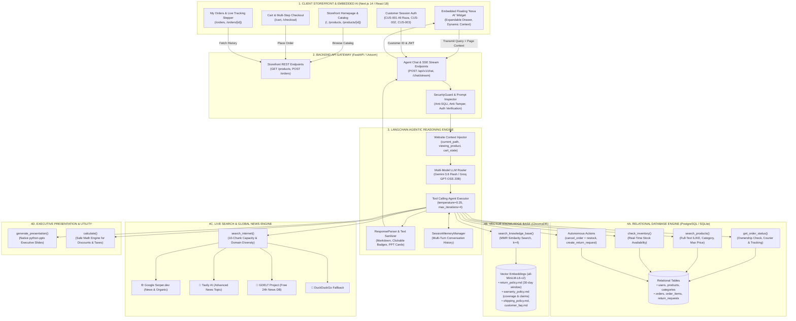
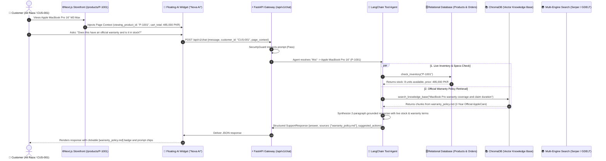
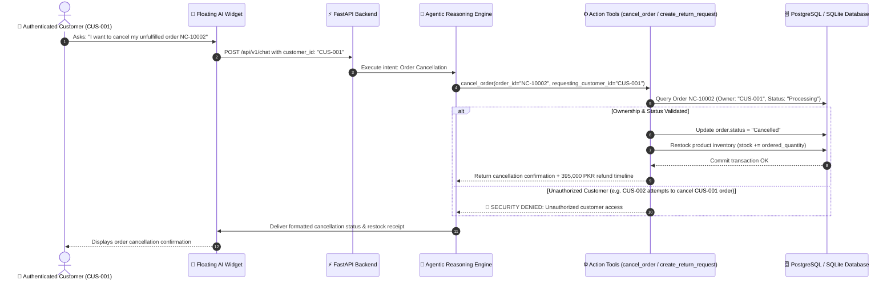
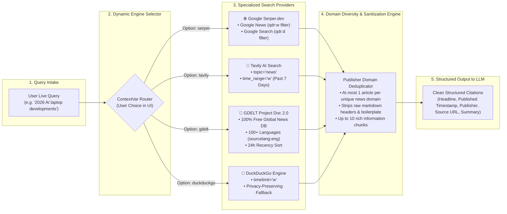
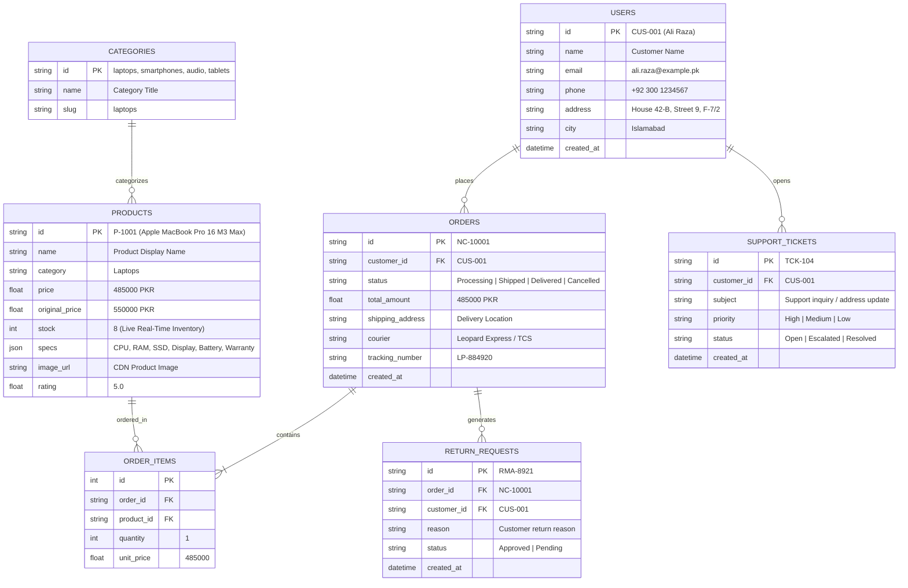

# SupportIQ & NovaCart — Comprehensive System Architecture

> **Status:** Live & Production-Ready (Phase 01 Complete)  
> **Last Updated:** September 3, 2026  
> **Location:** `D:\SupportIQ\SYSTEM_DESIGN.md`  
> **Interactive Browser View:** Open [`D:\SupportIQ\system_design.html`](file:///D:/SupportIQ/system_design.html) for full-screen zoomable rendering.

---

## 1. Master Full-Stack Architecture

---

## 2. Context-Aware Dual-Engine Retrieval Flow

---

## 3. Autonomous Order Action & Inventory Reconciliation

---

## 4. Multi-Provider Search Scraper Architecture

---

## 5. Relational Database Schema (PostgreSQL / SQLite)

---

## 6. Architecture Roadmap & Milestone Tracker

| Phase | Milestone | Status | Key Implementations & Components |
| :--- | :--- | :---: | :--- |
| **Phase 01** | **NovaCart Storefront Frontend** | ✅ **Done** | Next.js 14 Storefront, 12 Flagship Tech Products (Apple, Samsung, Dell, Lenovo, ASUS, Google, Sony), Cart (`/cart`), Checkout (`/checkout`), Order Tracking (`/orders`), and Embedded Floating Nova AI Widget. |
| **Phase 02** | **Relational Database & Store Backend** | ⏳ **Next** | PostgreSQL / SQLite database with SQLAlchemy ORM models replacing static CSV files, seed migrations, and storefront REST endpoints. |
| **Phase 03** | **Live AI Widget & Context Bridge** | 📋 **Planned** | Real-time browser page context transmission (`viewing_product`, `cart_state`), SSE token streaming, and dynamic quick-action prompts. |
| **Phase 04** | **SQL Database Agentic Tools** | 📋 **Planned** | Live database-backed `search_products`, `get_order_status`, and `check_inventory` with real-time stock counters. |
| **Phase 05** | **Context-Aware RAG & Policy Grounding** | 📋 **Planned** | Dual-source synthesis combining live database product specs with official ChromaDB vector policy documents. |
| **Phase 06** | **Autonomous Agentic Actions** | 📋 **Planned** | Self-service order cancellations with automated stock replenishment, RMA return request generation, and support tickets. |
| **Phase 07** | **Authentication & Multi-Tenant Security** | 📋 **Planned** | JWT session token verification and cross-customer authorization barriers (`customer_id` ownership checks). |
| **Phase 08** | **Production Analytics & Deployment** | 📋 **Planned** | Live sales analytics dashboard, automated executive PowerPoint presentation generation (`.pptx`) from SQL data, and Docker Compose orchestration. |
